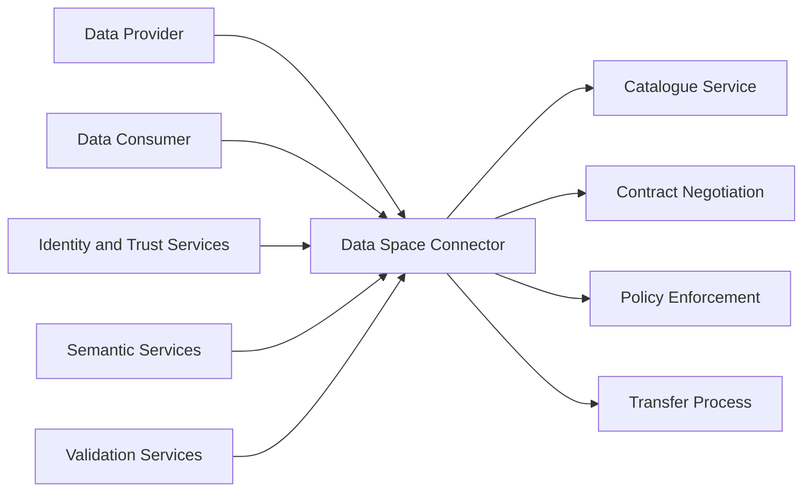

# A Connector Architecture

> **Group:** A – Data Exchange & Connector  
> **Technology:** FIWARE Data Space Connector / TNO Trusted Secure Gateway (TSG)  
> **Research Focus:** Data Exchange and Connector Architecture  

---

# 1. Architecture Overview

## Purpose

A Data Space Connector provides the operational layer for secure and
policy-governed data exchange between independent participants.

Unlike traditional API-based data sharing, where access control is usually
performed before data retrieval, a connector manages the complete exchange
lifecycle:

- Metadata publication
- Data discovery
- Contract negotiation
- Policy enforcement
- Governed data transfer

This document analyses the architecture of Data Space Connectors, focusing on
the FIWARE Data Space Connector as an implementation example.

The analysis covers:

- Connector responsibilities
- Internal functional components
- Exchange workflow
- Standards and interoperability
- Engineering considerations

---

# Architecture at a Glance

| Item | Description |
|---|---|
| Research Topic | Data Space Connector Architecture |
| Data Space Layer | Data Exchange and Connector Layer |
| Main Technologies | FIWARE Data Space Connector, TNO Trusted Secure Gateway |
| Core Standards | Dataspace Protocol (DSP), OpenAPI, JSON-LD |
| Main Actors | Data Provider, Data Consumer |
| Main Functions | Metadata exchange, contract negotiation, policy enforcement, data transfer |
| Input | Data offerings, metadata, access requests |
| Output | Negotiated agreements and governed data exchange |
| Deployment Options | Docker Compose, Kubernetes |
| Main Focus | Architecture analysis, workflow evaluation and interoperability |

---
# 2. Role of Connectors in a Data Space

A Data Space Connector enables organisations to exchange data while
maintaining control over ownership, access conditions and usage policies.

The connector acts as a governance layer between data providers and
consumers.

It is responsible for controlling how data is discovered, accessed and
transferred according to agreed conditions.

## Connector Responsibilities

A Data Space Connector provides:

### Metadata Management

- Publishing data offerings
- Exchanging dataset descriptions
- Supporting data discovery
### Contract Negotiation

- Establishing usage agreements
- Managing access conditions
- Recording negotiation states

### Policy Enforcement

- Evaluating usage rules
- Applying access restrictions
- Ensuring agreement compliance

### Data Transfer Management

- Authorising transfers
- Executing data exchange
- Monitoring transfer status

---

## Connector Boundaries

The connector does not replace other specialised Data Space services.

It does not:

- Create semantic models
- Issue digital identities
- Perform compliance certification
- Validate metadata constraints
- Store all exchanged datasets centrally

Instead, the connector integrates with external trust, semantic and validation
services through standardized interfaces.

---

# 3. FIWARE Data Space Connector Overview

The FIWARE Data Space Connector is an open-source implementation designed to
support standards-based and governed data exchange.

It follows the principles of:

- Data sovereignty
- Policy-controlled access
- Metadata-driven discovery
- Standards-based interoperability

## 3.1 Data Sovereignty

Data providers maintain control over their data assets.

The connector does not require centralised storage of datasets. Instead, it
controls access and transfer according to predefined agreements.

---

## 3.2 Policy Before Data

Data exchange is not performed through unrestricted API access.

Before data transfer:

1. Consumers discover available offerings.
2. Access conditions are negotiated.
3. Policies are evaluated.
4. Data transfer is authorised.

---

## 3.3 Metadata Before Transfer

Metadata discovery occurs before actual data exchange.

Consumers first obtain information about:

- Dataset description
- Provider information
- Access conditions
- Usage policies

---

## 3.4 Standards-based Interoperability

The connector relies on open standards:

- Dataspace Protocol (DSP)
- JSON-LD
- OpenAPI
- HTTP APIs

These standards enable interoperability between different Data Space
implementations.

---

# 4. Connector System Architecture

The connector operates as the communication layer between participants.

It coordinates data exchange functions while integrating with external
services such as identity, semantic and validation systems.

## High-level Architecture

The architecture separates responsibilities into independent components,
improving:

- Maintainability
- Scalability
- Interoperability

---
# 5. FIWARE Connector Functional Architecture

The FIWARE Data Space Connector follows a modular architecture where each
component performs a specific role in the exchange lifecycle.

## FIWARE Component Architecture

![[FIWARE FDF 组件图 英文.jpg]]

This diagram explains the internal structure of the connector implementation.

---
## 5.1 Catalogue Service

The Catalogue Service manages metadata describing available data offerings.

It enables consumers to discover datasets without directly accessing the
underlying resources.

Typical metadata includes:

- Dataset identifier
- Provider information
- Description
- Endpoint information
- License
- Usage policies

---

## 5.2 Contract Negotiation

Contract negotiation establishes an agreement between provider and consumer
before data access is granted.

The negotiation defines:

- Access permissions
- Usage conditions
- Responsibilities
- Exchange rules

Typical states:

| State | Description |
| --- | --- |
| Requested | Consumer requests access |
| Offered | Provider proposes conditions |
| Accepted | Consumer accepts conditions |
| Finalized | Agreement established |

---

## 5.3 Policy Enforcement

Policy enforcement evaluates whether an access request complies with defined
rules.

Policies may specify:

- Allowed participants
- Usage purpose
- Time restrictions
- Redistribution limitations

---

## 5.4 Transfer Process

The Transfer Process executes the actual exchange after successful
negotiation.

Responsibilities include:

- Transfer initiation
- Secure transmission
- Status monitoring
- Completion tracking

---

# 6. Data Exchange Workflow

The connector follows a governed workflow rather than direct data access.

## Workflow Diagram

![[Data Exchange Workflow.jpg]]

The workflow contains five main stages:

## 6.1 Data Offering Publication

The provider registers a dataset and publishes metadata through the connector.

The published information includes:

- Dataset description
- Provider information
- Access endpoint
- Usage policies

---

## 6.2 Data Discovery

Consumers discover available offerings through catalogue metadata.

The catalogue allows consumers to:

- Search datasets
- Understand characteristics
- Review access conditions

---

## 6.3 Contract Negotiation

The consumer requests access and negotiates usage conditions with the
provider.

The agreement defines:

- Permissions
- Responsibilities
- Usage conditions

---

## 6.4 Policy Verification

The connector evaluates whether the requested access satisfies predefined
policies.

The verification checks:

- Participant permissions
- Contract conditions
- Usage restrictions

---

## 6.5 Governed Data Transfer

After successful negotiation and policy verification, the connector enables
controlled data exchange.

The transfer process ensures:

- Secure transmission
- Policy compliance
- Data sovereignty preservation

---

# 7. Connector Compared with Traditional REST APIs

| Aspect | Traditional REST API | Data Space Connector |
| --- | --- | --- |
| Main Goal | Data access | Governed data exchange |
| Discovery | API documentation | Metadata catalogue |
| Access Control | Authentication | Contract and policy |
| Metadata | Optional | Required |
| Data Sovereignty | Limited | Preserved |
| Transfer | Immediate access | Agreement-based transfer |
| Interoperability | Implementation dependent | Standards-based |

A connector therefore provides a governance layer above traditional data
exchange mechanisms.

---

# 8. Standards and Protocols

| Standard | Purpose |
| --- | --- |
| Dataspace Protocol (DSP) | Connector communication |
| JSON-LD | Metadata representation |
| OpenAPI | API description |
| HTTP/HTTPS | Data transport |
| OAuth2 | Authentication |

---

# 9. Engineering Evaluation

## Strengths

### Standards-based Architecture

Uses open standards instead of proprietary communication mechanisms.

### Data Sovereignty

Providers maintain control over data usage throughout the exchange lifecycle.

### Modular Design

Connector functions are separated into independent components.

### Interoperability

Different implementations can participate through common protocols.

---

## Limitations

### Deployment Complexity

A complete environment requires multiple services and configurations.

### External Dependencies

Trust, identity and semantic services require additional integration.

### Learning Curve

Understanding DSP, policies and contract negotiation requires technical
knowledge.

---

# 10. Conclusion

The Data Space Connector provides the operational foundation for governed data
exchange.

Unlike traditional APIs, it manages the complete lifecycle of data sharing,
including:

- Metadata publication
- Data discovery
- Contract negotiation
- Policy evaluation
- Controlled transfer

The FIWARE Data Space Connector demonstrates how modular architecture and open
standards can support secure and interoperable Data Spaces.

However, connectors operate as one component within a larger ecosystem and
must cooperate with specialised services for trust, semantics and validation.

---

# References

[1] FIWARE Foundation.  
*FIWARE Data Space Connector.*  
https://github.com/FIWARE/data-space-connector

[2] FIWARE Foundation.  
*FIWARE Data Space Connector Documentation.*  
https://github.com/FIWARE/data-space-connector/tree/main/docs

[3] Data Spaces Business Alliance (DSBA).  
*Technical Convergence Discussion Document.*  
https://data-spaces-business-alliance.eu/

[4] Eclipse Foundation.  
*Dataspace Protocol Specification.*  
https://eclipse-dataspace-protocol-base.github.io/DataspaceProtocol/

[5] Eclipse Foundation.  
*Eclipse Dataspace Components.*  
https://github.com/eclipse-edc

[6] Gaia-X European Association for Data and Cloud.  
*Gaia-X Trust Framework.*  
https://docs.gaia-x.eu/

[7] OpenAPI Initiative.  
*OpenAPI Specification.*  
https://spec.openapis.org/

[8] W3C.  
*JSON-LD 1.1.*  
https://json-ld.org/

[9] W3C.  
*Shapes Constraint Language (SHACL).*  
https://www.w3.org/TR/shacl/

[10] Docker Inc.  
*Docker Documentation.*  
https://docs.docker.com/

[11] Kubernetes Authors.  
*Kubernetes Documentation.*  
https://kubernetes.io/docs/