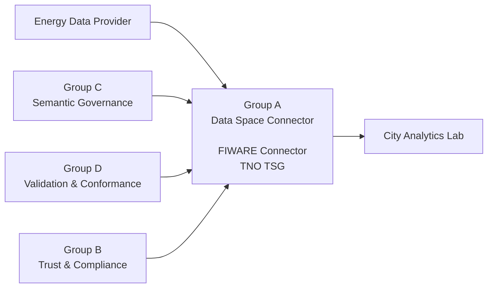
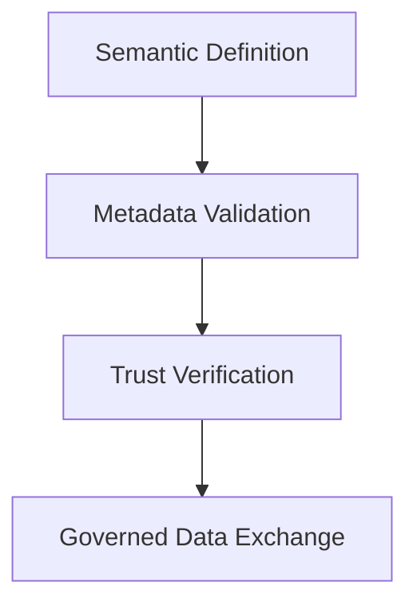
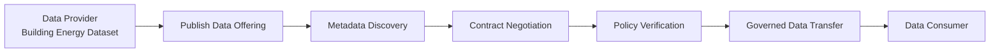

# DSSC Toolbox: Data Space Technology Investigation

## Overview

Modern organizations increasingly need to exchange data across different
institutions and platforms. However, traditional data sharing approaches,
such as direct database access or conventional API-based exchange, often
provide limited mechanisms for ensuring:

- Data sovereignty
- Trust management
- Semantic interoperability
- Controlled data usage

To address these challenges, the concept of **Data Spaces** has emerged as
a decentralized framework that enables organizations to exchange data while
maintaining control over their own data assets.

The **Data Spaces Support Centre (DSSC)** provides architectures, guidelines,
and technical resources to support the development of interoperable Data
Spaces.

This project investigates key technologies required to build a functional
Data Space ecosystem, including:

- **Semantic Governance**
- **Trust and Compliance**
- **Data Exchange and Connectors**
- **Validation and Conformance Testing**

The objective of this project is to understand how these components
cooperate and how they can support a complete governed data-sharing
workflow.

---

# Research Scenario

## Building Energy Consumption Data Product

To demonstrate the interaction between different Data Space technologies,
this project adopts a unified energy data-sharing scenario.

An energy data provider publishes an hourly building energy consumption
dataset. A city analytics organisation discovers the data product and
requests access.

Before data exchange is permitted, the Data Space requires:

- Semantic consistency
- Metadata validation
- Trusted participant verification
- Policy-controlled data exchange

---

## Actors

| Actor | Role |
|---|---|
| Energy Data Provider Ltd. | Publishes building energy consumption data |
| City Analytics Lab | Discovers and consumes data products |
| Data Space Governance Framework | Defines trust, semantic, and compliance requirements |

---

## Data Product

| Attribute | Value |
|---|---|
| Dataset | Building Energy Consumption Dataset API |
| Format | JSON |
| Frequency | Hourly |
| Unit | kWh |
| Endpoint | Mock API |
| License | CC-BY-4.0 |
| Coverage | Shenzhen demo district |
| Period | 2026-05-01 to 2026-05-02 |

---

# Data Space Architecture

A Data Space is not a single software platform. Instead, it consists of
multiple specialised components that cooperate through common standards.

The four groups investigated in this project represent different layers of
the Data Space ecosystem.



The overall workflow follows:



A detailed architecture overview illustrating the relationship between semantic governance, trust management, validation services, and data exchange connectors is provided in:

```
diagrams/dssc_architecture_overview.png
```

# Project Structure

| Group   | Research Area             | Main Responsibility                              |
| ------- | ------------------------- | ------------------------------------------------ |
| Group A | Data Exchange / Connector | Secure and governed data exchange                |
| Group B | Trust / Compliance        | Participant identity and compliance verification |
| Group C | Semantic Governance       | Common semantic models and vocabularies          |
| Group D | Validation / Conformance  | Metadata validation and testing                  |

# Group A Contribution: Data Exchange and Connector Layer

## Research Focus

Group A investigates how organisations exchange data within a Data Space through connector technologies.

The main technologies studied are:

- **FIWARE Data Space Connector**
- **TNO Trusted Secure Gateway (TSG)**

The research focuses on:

- Secure data exchange
- Data sovereignty preservation
- Contract-based data sharing
- Policy-controlled access
- Interoperable connector architecture

---

# What is a Data Space Connector?

A **Data Space Connector** is a software component deployed by each participant in a Data Space to enable secure, controlled, and sovereign data exchange.

Unlike a traditional API gateway, a connector does not only expose data endpoints. Instead, it supports the complete lifecycle of governed data sharing:

- Data offering publication
- Metadata exchange
- Data discovery
- Contract negotiation
- Policy enforcement
- Governed data transfer

Therefore, the connector acts as the operational exchange layer of a Data Space, working together with semantic services, trust frameworks, and validation mechanisms to enable interoperable and trustworthy data sharing.

---

# FIWARE Data Space Connector

The **FIWARE Data Space Connector** is an open-source implementation aligned with the recommendations of the **Data Spaces Business Alliance (DSBA)** and the **Dataspace Protocol (DSP)**.

Official repository:

https://github.com/FIWARE/data-space-connector

The connector supports:

- Data offering publication
- Metadata exchange
- Contract negotiation
- Policy-controlled data transfer
- Identity and trust integration

Detailed architecture analysis:

```
A_connector_architecture.md
```

## Deployment Investigation

Beyond architectural analysis, this project also investigates the practical
deployment aspects of the FIWARE Data Space Connector.

The deployment investigation covers:

- Required infrastructure and dependencies
- Deployment architecture
- Configuration requirements
- Local deployment feasibility
- Engineering challenges

Detailed deployment notes:

```
A_fiware_deployment_notes.md
```

---

# TNO Trusted Secusre Gateway (TSG)

This project also investigates the **TNO Trusted Secure Gateway (TSG)** as an alternative connector implementation.

The comparison between FIWARE Connector and TNO TSG focuses on:

- Architecture design
- Deployment approach
- Trust mechanisms
- Policy enforcement
- Interoperability capabilities

Detailed comparison:

```
A_tno_tsg_comparison.md
```

---

# Group A Workflow

Within the unified energy scenario, the connector layer enables governed exchange of the **Building Energy Consumption Dataset**.

## Input

| Input | Source |
| --- | --- |
| Semantic metadata | Group C |
| Validation results | Group D |
| Trusted participant information | Group B |
| Dataset API description | Data Provider |

---

# Data Exchange Demonstration

To validate the connector workflow in the unified energy scenario, Group A
provides a demonstration of the Building Energy Consumption Dataset exchange
process.

The demo illustrates:

- Data offering publication
- Metadata discovery
- Consumer access request
- Contract negotiation
- Governed data transfer

The demonstration focuses on how a dataset is transformed from a traditional
API resource into a governed Data Product within a Data Space environment.

Detailed demonstration workflow:

```
A_data_exchange_demo.md
```

---
## Process

### 1. Package Dataset as Data Offering

The Building Energy Consumption Dataset is transformed into a Data Space Data Offering containing:

- Dataset description
- Semantic metadata
- Access information
- Usage policies
- Provider information

The Data Offering represents the dataset as a governed and discoverable digital asset within the Data Space.

---

### 2. Publish Metadata

The connector publishes metadata information to enable data discovery.

Consumers can:

- Discover available datasets
- Understand dataset characteristics
- Review access conditions
- Identify applicable usage policies

---

### 3. Consumer Discovery and Access Request

A consumer searches available Data Offerings and submits an access request.

The connector verifies:

- Participant identity and trust information
- Access permissions
- Usage policies
- Contract requirements

---

### 4. Contract Negotiation and Governed Data Transfer

After successful negotiation:

- Access rights are established
- Usage policies are enforced
- Data is transferred through the connector under agreed conditions

The connector ensures that data exchange follows Data Space principles, including sovereignty, transparency, and controlled usage.




---

# Deliverables

Group A provides the following technical documentation:

| Document                       | Description                                                        |
| ------------------------------ | ------------------------------------------------------------------ |
| `A_connector_architecture.md`  | FIWARE Data Space Connector architecture analysis                  |
| `A_fiware_deployment_notes.md` | Deployment considerations and implementation notes                 |
| `A_tno_tsg_comparison.md`      | Comparison between FIWARE Connector and TNO Trusted Secure Gateway |
| `A_data_exchange_demo.md`      | Demonstration of governed data exchange workflow                   |
# Repository Structure

```
DSSC-Toolbox/

├── README.md

├── docs/

│   ├── A_connector_architecture.md
│   ├── A_fiware_deployment_notes.md
│   ├── A_tno_tsg_comparison.md
│   └── A_data_exchange_demo.md

├── diagrams/

├── demo/

├── examples/

└── references.md
```

---

# Key Findings

## Strengths

The Data Space connector approach provides several advantages:

### Standards-based Architecture

Enables interoperability between different organisations through common protocols, specifications, and open standards.

### Data Sovereignty Support

Allows data owners to maintain control over:

- Who can access their data
- Under which conditions data can be used
- How data usage policies are enforced

### Modular and Extensible Design

The connector architecture separates different functional components, allowing individual services to evolve independently.

### Distributed Data Space Compatibility

Supports collaboration between independent organisations without requiring centralised data storage or control.

### Policy-controlled Data Exchange

Enables governed data sharing based on:

- Usage agreements
- Access permissions
- Contractual rules
- Data governance policies

---

# Limitations

Several challenges remain for practical Data Space deployment:

## High Deployment Complexity

A complete Data Space environment requires integration of multiple supporting components, including:

- Identity management
- Trust frameworks
- Semantic services
- Policy engines
- Connector infrastructure

## Dependency on External Components

Connectors rely on additional services for:

- Participant verification
- Credential management
- Semantic interoperability
- Trust establishment

## Steep Learning Curve

Data Space concepts, protocols, and governance mechanisms require significant technical knowledge and understanding.

## Production Deployment Requirements

Real-world deployment requires:

- Reliable infrastructure
- Security management
- Monitoring and maintenance
- Operational support

---

# Future Work

Potential future improvements include:

- Complete end-to-end deployment of multiple Data Space components
- Integration with real-world energy datasets
- Automated participant onboarding workflows
- More comprehensive contract negotiation experiments
- Evaluation of additional connector implementations
- Performance and scalability testing

---

# Conclusion

This project demonstrates that a Data Space cannot be established through a single technology.

Instead, a complete Data Space ecosystem requires cooperation between:

- Semantic governance
- Trust management
- Validation services
- Data exchange connectors

The connector layer provides the operational foundation of the Data Space by enabling participants to:

- Publish data offerings
- Discover available datasets
- Negotiate access agreements
- Exchange data securely

while maintaining:

- Data sovereignty
- Security
- Transparency
- Interoperability

Through the Building Energy Consumption scenario, this project illustrates how technologies such as the **FIWARE Data Space Connector** and **TNO Trusted Secure Gateway (TSG)** support the development of a trustworthy and interoperable energy data-sharing ecosystem.

---

# References

1. FIWARE Data Space Connector  
   https://github.com/FIWARE/data-space-connector

2. Data Spaces Business Alliance (DSBA)  
   https://data-spaces-business-alliance.eu/

3. Dataspace Protocol Specification  
   https://eclipse-dataspace-protocol-base.github.io/DataspaceProtocol/

4. Gaia-X Trust Framework  
   https://docs.gaia-x.eu/

5. W3C JSON-LD  
   https://json-ld.org/

6. W3C SHACL  
   https://www.w3.org/TR/shacl/
